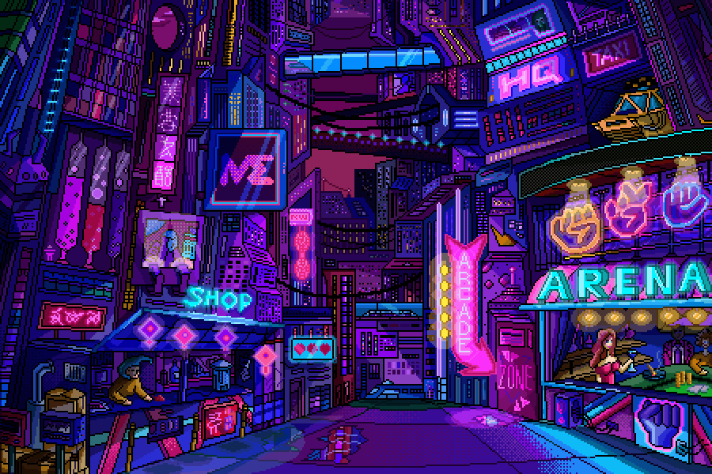

<!-- INTRO -->

  <h2>👋 Greetings, I'm Ricardo</h2>
  

    I’m a <strong>Biomedical Engineer</strong> and a <strong>Software Development</strong>, currently studying at <strong>42 Lisboa</strong>.
  

  

<!-- ABOUT ME -->
  <h2 align="center">About Me</h2>
  
  

    Curiosity has always driven me to learn and understand how things work. 
    A deep passion for mathematics and biology led me to pursue Biomedical Engineering, strengthening 
    my approach to problem-solving.
  

  

    At 42 Lisboa, I’ve been building a solid knowledge in software engineering through project-based 
    learning. Constantly challenging myself have become central to my growth as a developer and as a person.
  

  

    I work mainly with low-level programming, UNIX systems, and C/C++, while also
    gaining experience with higher-level languages and full stack development.
  

  

    I enjoy watching anime, reading manga, playing videogames and following football, supporting 
    my lifelong club, <strong>SL Benfica</strong>. Music is another constant presence in my life, 
    with <strong>Queen</strong> being my favorite band.
  

<!-- SKILLS -->

  <h2>Skills & Technologies</h2>

<table align="center">
  <tr>
    <!-- LANGUAGES -->
    <td align="center" width="33%">
      <strong>Languages</strong>  
      
      
      
    </td>
    <!-- FRONTEND -->
    <td align="center" width="33%">
      <strong>Frontend</strong>  
      
      
      
      
    </td>
    <!-- TOOLS -->
    <td align="center" width="33%">
      <strong>Tools</strong>  
      
      
      
    </td>
  </tr>
</table>

  

